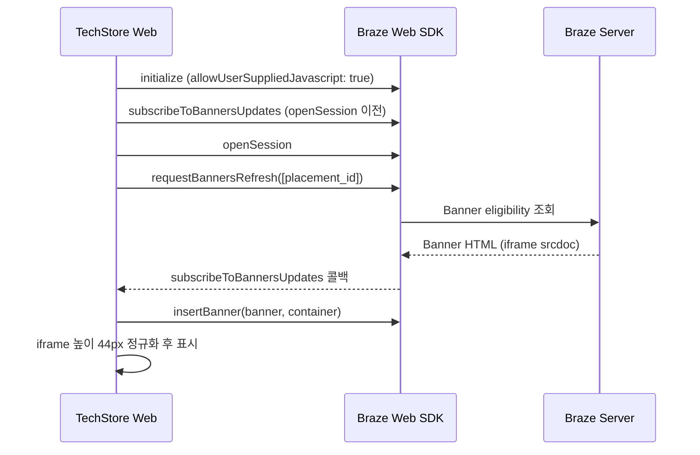

# Braze Banners Web 구현 가이드 (TechStore 실무 코드 기준)

이 문서는 TechStore Next.js 프로젝트에 구현된 **Braze Banners(Web SDK)** 연동을 기준으로, 개발·마케팅·고객 대응에 필요한 내용을 정리합니다.

**PoC 시나리오:** 상품상세(PDP) **「추가혜택」** 리스트 첫 번째 행에 멤버십 등급별 배너 인라인 노출 (롯데ON 유사 UX)

**관련 코드 경로**

| 파일 | 역할 |
|------|------|
| `src/lib/braze/config.ts` | Placement ID 등 환경 변수 |
| `src/lib/braze/client.ts` | SDK 초기화, `changeUser`, 로그인 후 `requestBannersRefresh` |
| `src/lib/braze/banners.ts` | Banner refresh, iframe 높이 정규화 |
| `src/hooks/useBrazeBanner.ts` | Placement 구독·삽입·갱신 훅 |
| `src/components/BrazeProvider.tsx` | 앱 전역 SDK 초기화 (`openSession` 전 구독) |
| `src/components/product/BrazeBannerRow.tsx` | PDP 배너 슬롯 UI |
| `src/components/product/ProductAdditionalBenefits.tsx` | 추가혜택 섹션 (배너 + 정적 행) |
| `src/app/globals.css` | iframe 44px 고정 CSS |

**공식 문서:** [Braze Banners — Developer Guide](https://www.braze.com/docs/developer_guide/banners/)

---

## 1. 역할 분담 (앱 vs Braze Dashboard)

| 담당 | 책임 |
|------|------|
| **웹 앱 (개발)** | Placement **위치** 예약, `placement_id` 설정, SDK 연동 (`subscribeToBannersUpdates`, `insertBanner`, `requestBannersRefresh`) |
| **Braze Dashboard (마케팅)** | Placement 생성, 배너 HTML/디자인, 오디언스, 우선순위, 캠페인 Launch |

> 배너 문구·색상·등급별 디자인은 **앱 코드에 두지 않습니다.** Dashboard Custom Code에서 관리합니다.

---

## 2. 아키텍처



**렌더링 구조**

```
ProductAdditionalBenefits
└── BrazeBannerRow          ← placement 슬롯 (배너 없으면 행 자체 미노출)
    └── div.braze-banner-row (44px)
        └── iframe.ab-html-banner   ← Braze Dashboard HTML
```

---

## 3. 사전 요건

| 항목 | TechStore 기준 |
|------|----------------|
| Web SDK | `@braze/web-sdk` **6.7.1+** (`package.json`) |
| Dashboard 기능 | 워크스페이스에 **Banners** 채널 활성화 (계정 매니저 확인) |
| 초기화 옵션 | `allowUserSuppliedJavascript: true` **필수** (`insertBanner` 동작 조건) |
| Endpoint | `NEXT_PUBLIC_BRAZE_SDK_ENDPOINT`는 **sdk.*** URL (rest.* 아님) |

---

## 4. 환경 변수

`.env.local` 예시 (`.env.example` 참고):

```bash
NEXT_PUBLIC_BRAZE_API_KEY=your-web-api-key
NEXT_PUBLIC_BRAZE_SDK_ENDPOINT=https://sdk.iad-XX.braze.com
NEXT_PUBLIC_BRAZE_ENABLE_LOGGING=false

# Dashboard Placement ID와 반드시 동일 (대소문자·언더스코어 포함)
NEXT_PUBLIC_BRAZE_BANNER_PDP_BENEFITS_PLACEMENT=pdp_additional_benefit
```

`config.ts`에서 읽는 방식:

```typescript
const pdpBenefitsPlacementId =
  process.env.NEXT_PUBLIC_BRAZE_BANNER_PDP_BENEFITS_PLACEMENT ??
  'pdp_additional_benefit';
```

---

## 5. SDK 초기화 (실무 코드)

### 5-1. `initializeBraze` — Banner 허용 옵션

```typescript
// src/lib/braze/client.ts
braze.initialize(config.apiKey, {
  baseUrl: config.sdkEndpoint,
  enableLogging: config.enableLogging,
  allowUserSuppliedJavascript: true, // ← Banner HTML/JS 렌더링 필수
});
```

### 5-2. `BrazeProvider` — `openSession` **이전**에 구독

Braze 문서: `subscribeToBannersUpdates`는 `openSession()` **이전**에 등록해야 합니다.

```typescript
// src/components/BrazeProvider.tsx
braze.subscribeToBannersUpdates(() => {});
await openBrazeSession();
```

### 5-3. 로그인 시 사용자 식별 + 배너 갱신

멤버십 등급(`membership_tier`) 변경 후 **같은 세션**에서 배너를 바꾸려면 `changeUser` 직후 `requestBannersRefresh`가 필요합니다.

```typescript
// src/lib/braze/client.ts — setBrazeUser
braze.changeUser(externalUserId);

if (membershipTier) {
  braze.getUser()?.setCustomUserAttribute('membership_tier', membershipTier);
}

braze.requestImmediateDataFlush();
braze.requestBannersRefresh([getBrazeClientConfig().pdpBenefitsPlacementId]);
```

PoC 로그인 페이지(`/login`)에서 `membership_tier`를 `GOLD` / `SILVER`로 선택하면 위 속성이 SDK·REST API 양쪽에 동기화됩니다.

---

## 6. Banner 갱신 동작 (Braze 공식 동작 + 실무 주의사항)

### 6-1. 자동 갱신되지 않음

Banners는 **실시간 자동 갱신되지 않습니다.** 아래 시점에만 갱신됩니다.

| 시점 | `requestBannersRefresh` 토큰 소비 |
|------|----------------------------------|
| 새 세션 시작 | 자동 refresh (캐시 publish, 토큰 **미소비**) |
| `changeUser` 호출 | 자동 refresh (캐시 publish, 토큰 **미소비**) |
| 앱에서 `requestBannersRefresh` 명시 호출 | 토큰 **소비** |

> 사용자 속성이 GOLD로 바뀐 **직후** 같은 세션에서 이전 배너(SILVER 등)가 보이는 경우, **`requestBannersRefresh` 미호출** 또는 **Braze 서버 속성 반영 지연**을 의심합니다.

### 6-2. Rate limiting (Web SDK 6.1.0+)

- 세션당 refresh **토큰 5개**로 시작
- **180초(3분)**마다 토큰 1개 충전
- 토큰 없을 때 `requestBannersRefresh` 호출 → 요청 스킵 + SDK 에러 로그

**실무 권장:** 로그인·등급 변경·주요 액션 후 **1회** refresh. 짧은 간격 폴링 금지.

### 6-3. 속성 반영 지연

`setCustomUserAttribute` 직후 즉시 refresh하면, Braze 서버가 아직 eligibility를 갱신하지 않았을 수 있습니다. 필요 시 **수백 ms~수초 지연** 후 refresh하거나, REST `/users/track`으로 속성을 먼저 보낸 뒤 refresh합니다. (TechStore PoC는 로그인 시 REST + SDK 동시 호출)

### 6-4. TechStore 갱신 호출 지점

| 시점 | 코드 |
|------|------|
| PDP 진입 | `useBrazeBanner` → `refreshBrazeBanner(placementId)` |
| 로그인 / 등급 변경 | `setBrazeUser` → `requestBannersRefresh` |
| SDK 내부 iframe 교체 | `MutationObserver` → `normalizeBrazeBannerIframeAsync` |

---

## 7. UI 연동 (실무 코드)

### 7-1. 추가혜택 섹션에 슬롯 배치

```tsx
// src/components/product/ProductAdditionalBenefits.tsx
<div className="min-w-0 flex-1 divide-y divide-gray-100">
  <BrazeBannerRow />   {/* Braze Banner — 없으면 null */}
  <BenefitRow>회원 최대 1.09% L.POINT 적립</BenefitRow>
  ...
</div>
```

- 정적 혜택 행: `h-11` (44px) 고정
- 배너 없음 / 비대상 / 캠페인 Stop → **행 자체 미노출** (fallback 문구 없음)

### 7-2. `useBrazeBanner` 핵심 흐름

```typescript
// 1. 구독
braze.subscribeToBannersUpdates(() => renderBanner());

// 2. 캐시된 배너 렌더
const banner = braze.getBanner(placementId);
if (!banner || banner.isControl) {
  setStatus('hidden'); // 행 숨김
  return;
}

// 3. 삽입 (insertBanner는 동기적으로 subscribe 콜백을 다시 호출함 → 중복 insert 방지)
if (lastInsertedKeyRef.current !== banner.id) {
  braze.insertBanner(banner, container);
}

// 4. iframe load 후 높이 정규화 완료 시에만 표시
await normalizeBrazeBannerIframeAsync(container);
setStatus('live');

// 5. 서버에서 최신 eligibility 조회
refreshBrazeBanner(placementId);
```

### 7-3. iframe 높이 정규화가 필요한 이유

Braze는 Banner를 **iframe(srcdoc)** 으로 삽입합니다. SDK 기본 CSS는 `iframe { height: 100% }`이고, iframe 내부 `body`에 기본 margin이 있어 **리스트 행(44px)과 어긋납니다.**

TechStore는 삽입 후 앱 코드에서:

1. iframe 요소 높이 44px 고정
2. iframe `contentDocument`에 reset CSS 주입
3. `brazeBridge.setBannerHeight(44)` 호출
4. `live` 상태 전환은 정규화 **완료 후**

```typescript
// src/lib/braze/banners.ts — BRAZE_BANNER_ROW_HEIGHT_PX = 44
```

```css
/* src/app/globals.css */
.braze-banner-row {
  height: 44px;
  min-height: 44px;
  max-height: 44px;
  overflow: hidden;
}
```

---

## 8. Braze Dashboard 설정

### 8-1. Placement 생성

| 필드 | 값 (PoC) |
|------|----------|
| Placement ID | `pdp_additional_benefit` |
| Name | `상품상세 추가혜택` (표시용) |

> Placement ID는 앱 `.env`의 `NEXT_PUBLIC_BRAZE_BANNER_PDP_BENEFITS_PLACEMENT`와 **완전 일치**해야 합니다.

### 8-2. 캠페인 구성 — 등급별 2캠페인 (권장)

동일 Placement에 캠페인 2개. 유저는 조건에 맞는 **1개만** 수신합니다.

| | Campaign A (GOLD) | Campaign B (SILVER) |
|---|---|---|
| Audience | `membership_tier` = `GOLD` | `membership_tier` = `SILVER` |
| Priority | High | Medium |
| Compose | Custom Code (아래 HTML) | Custom Code (아래 HTML) |

**대안:** 캠페인 1개 + Liquid 분기 (Dashboard Preview에서 `membership_tier` 테스트 필요)

### 8-3. Custom Code — GOLD 캠페인

> **드래그앤드롭 에디터 사용 금지** (기본 padding/border가 높이를 깨뜨림). **Custom Code**만 사용.

```html
<style>
  html, body {
    margin: 0 !important;
    padding: 0 !important;
    width: 100% !important;
    height: 44px !important;
    overflow: hidden !important;
    background: transparent !important;
  }
  body {
    display: flex !important;
    align-items: center !important;
  }
  a.ab-benefit-row {
    display: flex;
    align-items: center;
    gap: 8px;
    margin: 0;
    padding: 0;
    height: 44px;
    width: 100%;
    box-sizing: border-box;
    text-decoration: none;
    font-family: -apple-system, BlinkMacSystemFont, 'Segoe UI', sans-serif;
    cursor: pointer;
  }
</style>

<a
  class="ab-benefit-row"
  href="https://www.braze.com/docs/developer_guide/banners/"
  target="_blank"
  rel="noopener noreferrer"
>
  <span style="background:#ffe4e6;color:#e11d48;font-size:11px;font-weight:600;padding:2px 6px;border-radius:4px;white-space:nowrap;">ON멤버십</span>
  <span style="flex:1;font-size:14px;line-height:20px;color:#f43f5e;">[등급혜택] GOLD 등급 최대 5% 추가 적립!</span>
  <span style="color:#9ca3af;font-size:16px;line-height:1;">›</span>
</a>

<script>
  (function () {
    function setHeight() {
      if (window.brazeBridge && typeof window.brazeBridge.setBannerHeight === 'function') {
        window.brazeBridge.setBannerHeight(44);
      }
    }
    window.addEventListener('ab.BridgeReady', setHeight);
    window.addEventListener('load', setHeight);
  })();
</script>
```

### 8-4. Custom Code — SILVER 캠페인

GOLD HTML과 동일 구조. 뱃지·문구 색상만 변경:

```html
<!-- <style> 블록은 GOLD와 동일 -->

<a
  class="ab-benefit-row"
  href="https://www.braze.com/docs/developer_guide/banners/"
  target="_blank"
  rel="noopener noreferrer"
>
  <span style="background:#e0e7ff;color:#4338ca;font-size:11px;font-weight:600;padding:2px 6px;border-radius:4px;white-space:nowrap;">ON멤버십</span>
  <span style="flex:1;font-size:14px;line-height:20px;color:#4f46e5;">[등급혜택] SILVER 등급 최대 3% 추가 적립!</span>
  <span style="color:#9ca3af;font-size:16px;line-height:1;">›</span>
</a>

<!-- <script> 블록은 GOLD와 동일 -->
```

### 8-5. Schedule / Launch

- **Start Time:** 현재 시각 이후
- **End Time:** 비움 (상시 PoC)
- **Launch** 후 앱에서 확인 (새 세션 또는 `requestBannersRefresh` 이후)

---

## 9. PoC 테스트 절차

1. `.env.local`에 Braze Web SDK 키 + Placement ID 설정
2. `npm run dev` → http://localhost:3000
3. `/login` → 멤버십 등급 **GOLD** 선택 후 로그인
4. `/product/1` → 추가혜택 첫 행에 GOLD 배너 확인
5. 로그아웃 → **SILVER**로 재로그인 → SILVER 배너 확인
6. 캠페인 **Stop** → 배너 행 **없음** (아래 정적 혜택만 표시)
7. 같은 세션에서 등급 변경 시 → 로그인 후 refresh로 배너 교체 확인

**브라우저 디버깅 (로컬):** `window.braze` 객체로 SDK 상태 확인 (`isLocalEnv`일 때 노출)

---

## 10. 트러블슈팅

| 증상 | 원인 | 해결 |
|------|------|------|
| 배너가 전혀 안 보임 | Placement ID 불일치 / 캠페인 미 Launch | ID·Launch·Start Time 확인 |
| 캠페인 Stop인데 문구가 보임 | (과거) 앱 fallback UI — **현재는 제거됨** | 최신 코드 기준 행 자체가 숨겨져야 정상 |
| 등급 바꿨는데 배너 안 바뀜 | 같은 세션에서 refresh 없음 / 속성 미반영 | `setBrazeUser` 후 `requestBannersRefresh`, REST track 후 재시도 |
| 새로고침마다 높이·위치가 다름 | iframe load 전 표시 / `display:none`에서 삽입 | `normalizeBrazeBannerIframeAsync` + `invisible` 슬롯 (현재 코드) |
| 오디언스 필터 무시되는 것 같음 | 비로그인 anonymous / `external_id` 불일치 | 로그인 후 `changeUser`, 필터 조건·속성명 확인 |
| `insertBanner` no-op | `allowUserSuppliedJavascript: false` | `initialize` 옵션 확인 |
| refresh 호출해도 실패 로그 | Rate limit 토큰 소진 | 3분 대기 또는 새 세션 |
| 드래그앤드롭으로 만든 배너 높이 깨짐 | 에디터 기본 padding/border | **Custom Code** + 44px reset |

---

## 11. 고객 대응 FAQ (롯데ON 유사 시나리오)

**Q. 추가혜택 리스트 한 줄에 Braze Banner를 넣을 수 있나요?**  
A. 가능합니다. 앱에 Placement 슬롯을 예약하고, Dashboard에서 Custom Code로 한 줄 HTML을 만듭니다.

**Q. 기존 혜택 문구와 어색하지 않게 할 수 있나요?**  
A. Custom Code로 높이 44px·패딩 0·보더 없음을 맞추고, 앱에서 iframe 정규화를 적용합니다. 드래그앤드롭 단독 사용은 비권장.

**Q. 등급별로 다른 배너를 보여줄 수 있나요?**  
A. (1) 캠페인 2개 + Audience 분리 (권장) 또는 (2) 캠페인 1개 + Liquid 분기.

**Q. 마케터가 코드 배포 없이 문구를 바꿀 수 있나요?**  
A. 네. Dashboard에서 캠페인 수정·Launch만 하면 됩니다 (앱은 Placement 슬롯만 유지).

**Q. 배너는 언제 갱신되나요?**  
A. 세션 시작, `changeUser`, 앱의 `requestBannersRefresh` 시점. **속성 변경만으로는 자동 갱신되지 않습니다.**

---

## 12. 확장 시 고려사항

- **Placement 추가:** PDP 외 홈·장바구니 등 — `requestBannersRefresh`에 placement ID 배열 전달 (최대 10개/요청)
- **우선순위:** 동일 Placement에 최대 25개 활성 메시지 — Priority로 제어
- **미지원:** API-triggered, Connected Content, Promotional Codes (Banner 채널 제한)
- **프로덕션:** PoC용 `membership_tier` 로그인 셀렉트 대신 실제 회원 API 연동

---

## 13. 변경 이력 (PoC)

| 항목 | 내용 |
|------|------|
| Fallback UI | 초기 PoC용 하드코딩 행 제거 → 배너 없으면 행 미노출 |
| `banner-templates.ts` | 제거 (템플릿은 Dashboard 전용) |
| iframe 정규화 | `banners.ts` + `globals.css` + Dashboard `<style>` reset |
| 로그인 연동 | `membership_tier` + `requestBannersRefresh` |

---

**문서 버전:** TechStore PoC 기준 (2026-06)  
**SDK:** `@braze/web-sdk` 6.7.1  
**Placement ID (PoC):** `pdp_additional_benefit`
